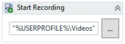
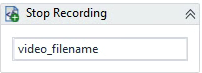
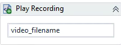

# OpenRPA.AviRecorder Activities

## Start Recording

Starts recording the execution of a Workflow inside OpenRPA. Users must set the `Folder` where it will be saved. The filename includes the Workflow name and the execution timestamp. The **AviRecorder Plugin** must be deactivated for this Activity. Users can choose a `Codec` and specify the `Folder` and `Quality` of the recording.

**Properties Parameters:**
- `Codec` - Choose a codec for recording (default `MotionJpeg`, options `Uncompressed`, `X264`).
- `DisplayName` - Title of the Activity.
- `Folder` - Folder to save the recording.
- `Quality` - Recording quality (0-100).

## Stop Recording

Stops recording the execution of a Workflow in OpenRPA and saves the `Filename` of the video into a variable.

**Properties Parameters:**
- `DisplayName` - Title of the Activity.
- `Filename` - Variable for the video filename.

## Play Recording

Plays a recording of a Workflow execution inside OpenRPA. To use this Activity, pass the `Filename` of the recording, which was recorded with the `Start Recording` and `Stop Recording` Activities.

**Properties Parameters:**
- `DisplayName` - Title of the Activity inside the sequence.
- `Filename` - Filename of the recording to be played.

