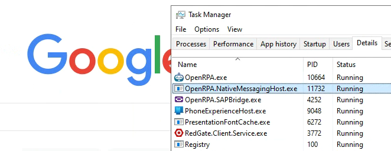
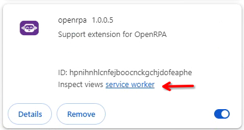
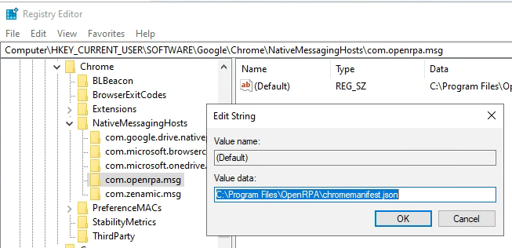

# Native Messaging

Install chrome plugin from [this link](https://chrome.google.com/webstore/detail/hpnihnhlcnfejboocnckgchjdofeaphe) 

You can Install the Mozilla Firefox plugin from [this link](https://addons.mozilla.org/en-US/firefox/addon/openrpa/)

# Get tab

Using Result property will return the current tab open  
Using Results property will return an array with all open tabs  
By default uses chrome for Result, and all browser for "Results"  
To filer or set browser type, set "Browser" property to "chrome", "ff" or "edge"  

# Troubleshooting tips

When you install the chrome extenstion, and open a page ( that is not a local file or starts with chrome:// ) then extension will try an make connection to OpenRPA by tellopen Chrome to start the NativeMessaging application.
So look open chrome, go to https://google.com then open task manager , got to details and look for OpenRPA.NativeMessagingHost.exe

If that is not running, 3 things you can check

## check the extension log in chrome.

Open chrome://extensions/ and enable Developer mode

Then click Service Worker on OpenRPA and look for errors.

## Check chrome registry key

When OpenRPA is installed, and when when OpenRPA starts and native messaging extension has been installed, it will create this registry key.
Make sure Chrome is instructed to enable the NativeMessaging application for the OpenRPA extension.
Open regedit and navigate to Computer\HKEY_CURRENT_USER\SOFTWARE\Google\Chrome\NativeMessagingHosts\com.openrpa.msg and make sure the default key is pointing to C:\Program Files\OpenRPA\chromemanifest.json

## Check chrome manifest values

When OpenRPA is installed will update update chromemanifest.json with the install settings.
This file tells chrome how to run the native messaging application and what extension are allowed to talk to it.
Open C:\Program Files\OpenRPA\chromemanifest.json and ensure the path is correct, and you can compare the id for OpenRPA extension on the chrome://extensions/ to the list in allowed_originsinside chromemanifest.json
