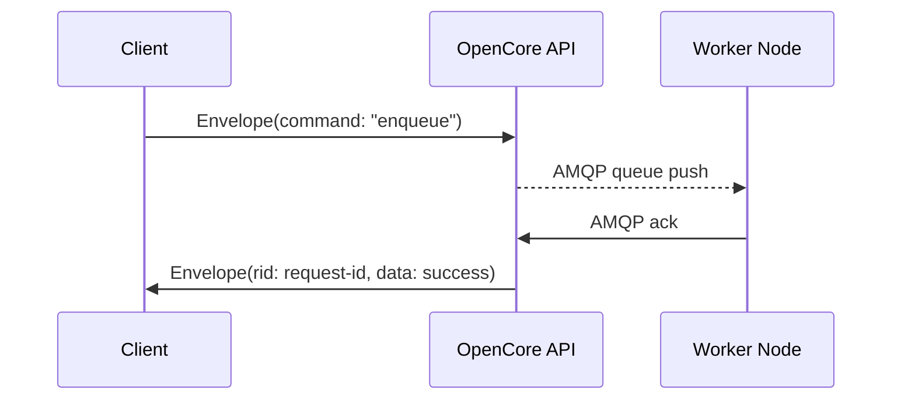

# Communication Protocols & API

OpenCore exposes several protocols and interfaces—both for external clients integrating with the platform and for internal components coordinating among themselves. This page describes the supported transports, message formats, authentication mechanisms, network requirements, and examples to help you plan your integration and network topology.

---

## External Client Interfaces

### gRPC (Protocol Buffers over HTTP/2)
- **Protocol**: HTTP/2
- **Schema**: All RPCs and messages are defined in Protocol Buffers (proto3) in the [openiap/proto](https://github.com/openiap/proto) repository.
- **Transport**: gRPC supports bi‑directional streaming, deadlines, and built‑in load balancing.
- **TLS**: Recommended for production; configured via your OpenCore server certificates.
- **Typical Use**: High‑performance command and control, streaming events, querying workflow state.

### WebSocket API
- **Protocol**: WS/WSS
- **Message Envelope**: Uses the same protobuf‑defined `Envelope` wrapper sent as binary messages.
- **Streaming**: Real‑time push of events (e.g. work item arrival, state changes).
- **Use Cases**: UIs, dashboards, custom clients needing low‑latency updates, but lacks support of gRPC.

### REST API (Experimental)
- **Protocol**: HTTP/1.1 (JSON)
- **Endpoints**: `/api/v1/...`
- **Use Cases**: Simple CRUD operations, administrative tasks, or integrations where gRPC is not available.
- **Limitations**: No streaming; intended as a compatibility layer.  
- **Authentication**: Bearer tokens in `Authorization: Bearer <JWT>` header.

All RPCs and messages are defined in Protocol Buffers (proto3) in [openiap/proto](https://github.com/openiap/proto).


---

## Envelope Message Format

All external protocols wrap application payloads in a common `Envelope` message. This ensures consistent routing, sequencing, and authentication.

```protobuf
message Envelope {
  string command    = 1;   // e.g. "signin", "enqueue", "queryEntities"
  int32  priority   = 2;   // message priority (0–3)
  int32  seq        = 3;   // per‑connection sequence number
  string id         = 4;   // unique message identifier
  string rid        = 5;   // reply‑to id for responses
  google.protobuf.Any data = 6;   // actual payload
  string jwt        = 7;   // optional per‑message JWT
  string traceid    = 8;   // for distributed tracing
  string spanid     = 9;   // for distributed tracing
}
```

- **`id`**: unique message identifier.
- **`rid`**: unique message identifier of message this is a reply too.
- **`command`**: determines the payload type and handler.
- **`seq`** & **`rid`**: enable ordered delivery and correlation.
- **`jwt`**: allows per‑message impersonation or elevated privileges.
- **priority**: (0–3, priority of message inside OpenCore)
- **Tracing**: integrates with OpenTelemetry by propagating `traceid`/`spanid` to trace across app domains.

---

## Supported Transport Protocols

| Protocol      | Transport  | Use Case                                 |
|---------------|------------|------------------------------------------|
| gRPC          | HTTP/2     | Primary RPC interface; streaming + batch |
| WebSocket     | WS/WSS     | Real‑time events and subscriptions       |
| TCP Socket    | TCP        | Legacy clients, fixed‑format streams     |
| Named Pipes   | Windows    | Local IPC on Windows hosts              |
| Experimental REST Chunked | HTTP/1.1 chunked | File transfer, large payloads |

---

## Internal Component Communication

- **Message Bus**: OpenCore uses RabbitMQ (AMQP) for decoupled, durable messaging.  
  - Queues/Exchanges are provisioned via the API (with authentication and ACL).
  - Supports priority queues, delayed messages, and dead‑lettering.
- **Database Change Streams**: MongoDB replica‑set change streams power cache invalidation and reactive features.
- **Control Plane ↔ Workers**: Workers poll or subscribe to queues; control plane issues tasks via AMQP or gRPC.

---

## Authentication & Authorization

- **JWT Tokens**: All API calls require a valid JWT—either obtained via the `signin` command (Envelope) or passed as an HTTP Bearer token.  
- **Access Control Lists**:  
  - **Users**: Everything resolves around a user, if no user is supplied and guest accounts are enabled, then runs as Guest user.
  - **Roles**: All message queues, workitem queues and every object in the database has an Access Control List associated with it, that control who can do what with the object. OpenCore supports nested roles to better handle complex permission shcemas.
- **TLS Everywhere**: Encrypt all client‑server and inter‑service traffic.
- **SSO Integration**: Support for OAuth2/OIDC providers (e.g., Keycloak, Azure AD).

---

## Network Requirements & Ports

| Component            | Default Port | Protocol    | Notes                                  |
|----------------------|-------------:|-------------|----------------------------------------|
| OpenCore API Server  |         443  | HTTPS/gRPC  | Support for HTTP/2 (gRPC) & REST       |
| WebSocket Gateway    |         443  | WSS         | Same endpoint as API; multiplexed      |
| Named Pipes (Win)    |  `\\.\pipe\OpenCore` | IPC| Local agent deployments               |

> **Tip:** All external clients should connect via a load-balanced HTTPS/gRPC endpoint. Internal services should connect using gRPC port 50051. Cross communication between services should **only** happen via SDK and message queue or workitem queues.

---

## Example API Usage

### gRPC Client (Node.js)
```js
const { Client } = require('openiap');
const client = new Client();
client.connect();
const query_result = client.query({ collectionname: 'entities', query: '{}', projection: '{"name":1}' });
console.log("result", query_result);
client.free();
```

### gRPC Client (python)
```python
from openiap import Client
client = Client()
client.connect()
query_result = client.query(collectionname="entities", query="{}", projection="{\"name\": 1}")
print("result", query_result)
client.free()
```

### gRPC Client (C#)
```c#
static void Main(string[] args) {
    MainAsync(args).GetAwaiter().GetResult();
}
static async Task MainAsync(string[] args) {
    Client client = new Client();
    await client.connect();
    string results = await client.Query<string>("entities", "{}", "{\"name\": 1}");
    Console.WriteLine("result: " + results);    
}
```

### gRPC Client (Rust)
```rust
use openiap_client::{OpenIAPError, Client, QueryRequest};
async fn main() -> Result<(), OpenIAPError> {
    let client = Client::new_connect("").await?;
    let q = client.query( QueryRequest::with_projection(
        "entities",
        "{}",
        "{\"name\":1}"
    )).await?;
    let items: serde_json::Value = serde_json::from_str(&q.results).unwrap();
    let items: &Vec<serde_json::Value> = items.as_array().unwrap();
    for item in items {
        println!("Item: {:?}", item);
    }
    Ok(())
}
```
### gRPC Client (C)
```c
#include <stdio.h>
#include <string.h>
#include "clib_openiap.h"
struct ClientWrapper *client = create_client();
int main(void) {
  if (client == NULL) {
      fprintf(stderr, "Error: Failed to create client.\n");
      return 1;
  }

  const char *server_address = "";
  struct ConnectResponseWrapper *conn_resp = client_connect(client, server_address);
  if (conn_resp == NULL) {
      fprintf(stderr, "Error: client_connect returned NULL.\n");
      return 1;
  }

  if (!conn_resp->success) {
      fprintf(stderr, "Connection failed: %s\n", conn_resp->error);
      return 1;
  } else {
      printf("Connected successfully! Request ID: %d\n", conn_resp->request_id);
  }
  free_connect_response(conn_resp);
  // Build a query request for the "entities" collection.
  QueryRequestWrapper req;
  req.collectionname = "entities";
  req.query = "{}";
  req.projection = "{ \"name\": 1 }";
  req.orderby = NULL;
  req.queryas = NULL;
  req.explain = false;
  req.skip = 0;
  req.top = 0;
  req.request_id = 1; // sample request id

  struct QueryResponseWrapper *query_resp = query(client, &req);
  if (query_resp == NULL) {
      printf("Error: query returned NULL.\n");
  } else {
      if (!query_resp->success) {
          printf("Query failed: %s\n", query_resp->error);
      } else {
          printf("Query succeeded. Results: %s\n", query_resp->results);
      }
      free_query_response(query_resp);
  }
    client_disconnect(client);
    free_client(client);
    
    printf("Exiting CLI.\n");
    return 0;
}

```

---

## Sequence Diagram (Client Request)



---

> **Next:**  
> Proceed to the [Scalability & Performance](Scalability&#32;&amp;&#32;Performance) page to understand how OpenCore scales under enterprise workloads.