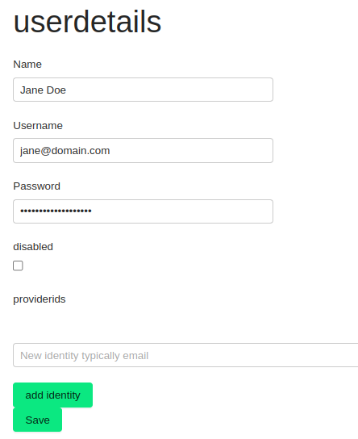

# Creating a New User

To add a new user to your OpenCore environment, start by selecting `Users` from the main menu. Then, click on the `Add User` button located in the top right corner of the screen.

This action will open a form for you to fill out in order to create a new user.

> **Important:**
> Make sure to use a valid email as the username. When the user logs in using federation, this email will be used to automatically associate them with your company during their first login.
