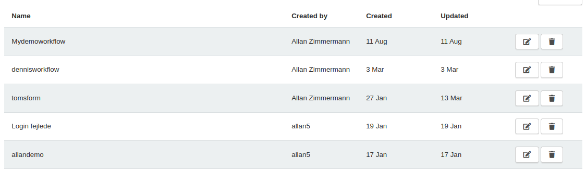
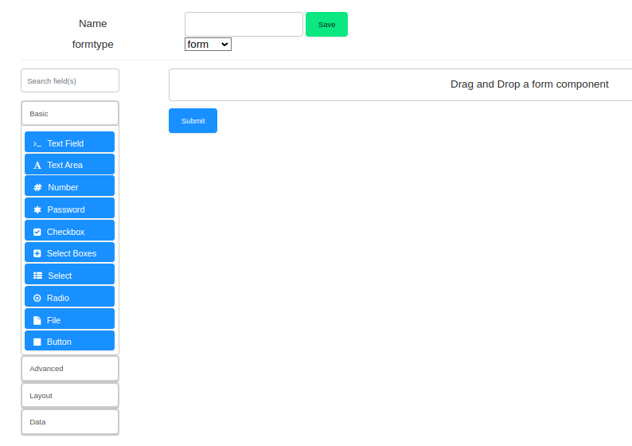
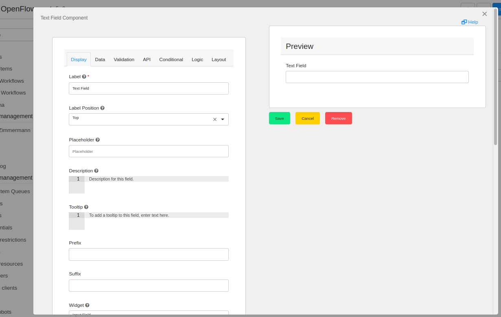

---

layout: default
title: Creating Web Forms
parent: What Is OpenCore
nav_order: 14
---
# Creating Web Forms
Forms are a user-friendly way of passing input to a workflow by creating dynamic OpenCore's webpages. There are two ways of generating a Form: one of them is through OpenCore's automatically generated Forms which are created upon saving a Workflow into its repository and the other one is manually creating a Form and connecting it to a Node-RED workflow.

For thorough information on how to use Forms, please refer to [form.io Intro](https://help.form.io/userguide/introduction/) (`https://help.form.io/userguide/introduction/`). Most of this chapter is based on this guide.

Creating a Form
===============

Creating a form is rather easy and simple. Go to the Forms page, where all Forms are listed, available under the [Forms page](https://app.openiap.io/#/Forms) and click the Navy blue `Add form` button.

Now at the Forms edit page, there are many Form components from which you can choose. For general purposes, we are only going to discuss the most used one here: Text Field Component. The other ones will be discussed further on in their specific sections. 

Drag the Text Field Component Form from the Basic category into the Form workspace. Immediately after, a window containing all the parameters to configure the Form Component will appear.

Configuring the Form Component
==============================
Below are the steps needed to properly configure a Form Component, a TextField in our example.

- **Changing Form Label**

   To change the Form's label, i.e., the title which will appear for the end-user, simply click the Display tab and change the input form titled **Label**. The changes are shown real-time.

- **Assigning Input Variable**

   To assign the input form to a variable configured inside the OpenRPA workflow you've mapped to OpenCore, simply go to the API tab and insert the name of the variable inside **Property Name** and press save. Now the next time this workflow is called, a new parameter will appear.

- **Assigning Form to Node-RED Workflow**

   Now it is required that you assign a Form to a Node-RED workflow. To do that, go to Node-RED and click twice on the `Workflow Out` node you want to assign the form to. The `Edit workflow out node` tab appears and you must select the form you've just created in the `Userform` dropdown.

For more information on how to configure the Form Component, please refer to the OpenCore Forms section.

... [Further sections continue with detailed explanations and associated images] ...

