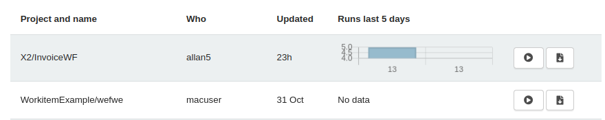

# Invoke OpenRPA Workflows page

What is it?
===========
Workflows in OpenRPA and OpenFlow are the same thing, an algorithm or a sequence of steps that execute a meaningful task. The difference is that when you invoke a workflow in OpenFlow, it creates an instance of that workflow. By accessing the Workflows tab, you may invoke workflows remotely, meaning, the stack in OpenFlow will send a message to the available agent to process and execute the given workflow.

From OpenFlow, you can create forms, grant permissions to a given workflow, and most importantly, invoke it.

OpenFlow automatically manages the workflow repository. When properly connected, by saving a workflow inside OpenRPA, it will also automatically appear inside the Workflows webpage.

To download a workflow, simply go to the RPA Workflows link and click download. After downloading the .XAML file, you may share it with others or import it into your OpenRPA client.

Invoking
========

- **Methods for Invoking**
  
  Here we discuss the methods for invoking a workflow using OpenFlow.

- **Invoking through OpenFlow's RPA Workflows Page**

  To invoke a workflow through OpenFlow, simply go to [RPA Workflows page](https://app.openiap.io/#/RPAWorkflows) and click Invoke. Another page for the specific workflow will be opened, where all the forms needed to be filled are going to be presented. Simply fill them and click Invoke again. The input data is then sent to the chosen robot/agent, and it will start processing the workflow.

  Data processing is bi-directional: input parameters are sent to a robot/agent, and the workflow output will also be returned. That means that you can make many workflows calling different applications. Think of it as a message; messages are sent, read, and replied to. Nothing prevents that message from being sent, read, or replied to multiple times.

>   For the user to invoke a workflow using OpenFlow, the user must have the proper permissions. See more at OpenRPA's chapter on Granting permissions to users/roles.

   **RPA Workflows page.**
