---

layout: default
title: Workitems
parent: What Is OpenCore
nav_order: 6
---
# Workitems
Inside OpenRPA or OpenFlow you can create a Workitem Queue. A queue can contain an unlimited number of Workitems. Each Workitem represents some data ( and some times files ) that needs to be processed some how. The queue will handle giving out Workitems to clients that asks for a new item to process, conforming to special rules, like how many times can an item be tried before failing completely, in what order they should be process or if an Workitem should be post pone for an amount of time.
You can add Workitems from OpenRPA, in the openflow web interface or from within NodeRED. If you need to add a lot of items, you should use "Buld add" ( called Add workitems in NodeRED ) for better performance.
You can pop items from OpenRPA and NodeRED. ( pop means asking OpenFlow if there is an item ready to be processed, if there is, it will checkout that item to you, and update it's state to "Proccessing". It is now you responsibility to ensure the item changes state to "Retry" or "Successful" using Update Workitem.
If a Workitems fails, you can easily retry that item by clicking the Resubmit 
 button inside OpenFlow. 

A common practice is to create a "Main processing" workflow that pop items of an queue, and calls a "processing" workflow using Invoke OpenRPA.   
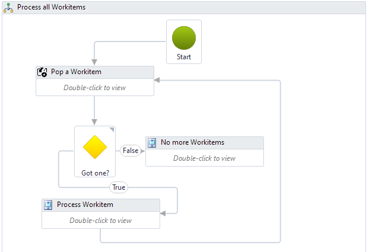  
By encapsulating this activity in a Try Catch activity, we can guarantee we always update the Workitem status to either Successful or Retry.  
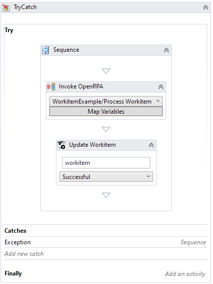
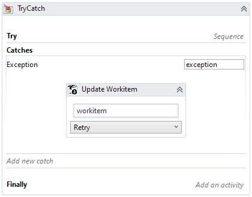  

If needed we can easily add a call to a separate Workflow that "prepares" everything ( Ensure needed applications are open and on the right tab etc. )
and add calls to a clean up workflow, that makes sure any error dialogs are closed, kill unresponsive applications, close down chrome etc.  
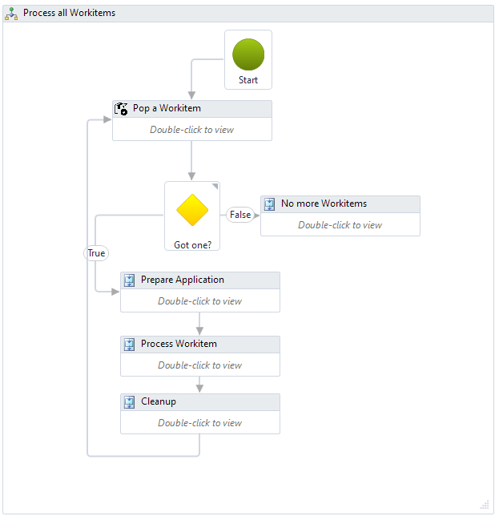

If you have a role with RPA enabled with multiple robots, you can assign this role to the project, and the Workitem Queue.  
On the Workitem queue you then set the role as robot target, and the main workflow as entry point workflow, and you can now scale out the workload handling to as may robot as you want ( preferably using [HD Robots](https://www.youtube.com/watch?v=VMQtr0fK3Rw) )

You can download an project with example workflows to get started here
This example is explained in 

[](https://youtu.be/6abXAJcKLRA)

For an example on how to convert an "classic" workflow into using work item queues, see the 2 part video here

[](https://youtu.be/_y9HU_XPD9c)

[](https://youtu.be/B9BnbrhG1yg)

## Multiple stages
Not all Workitems can or should be processed in one go. Often a unit of work will go though several steps. We can easily achieve this by adding one Workitem Queues for each step, and after a Workitem has compleed successful, we add a new Workitem in the next queue copying the values and files from the original item.  
For instance, say you create a Workitem for each invoice you receive. You process each invoice, like adding it to your local ERP system, you could then create a Workitem with a "nextrun" set to the payment due date of the invoice, to allow a workflow handle all payments at the correct time.  
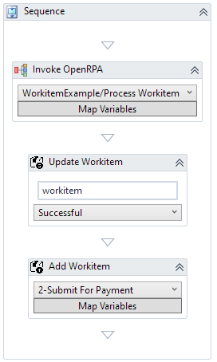

## OpenRPA video examples
You can find a few videos and example workflows at the following link  
[add-workitems-openrpa](https://github.com/open-rpa/examples-files/tree/master/add-workitems-openrpa)

# OpenRPA Work Item Activities

## Add Workitem
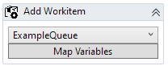  
Add new Workitem to the selected Workitem Queue. You can add an unlimited number of parameters using the Payload Property. You can also add as many files as you want, by setting "Files" to an array for strings with the full path and filename to the files you want to attach to the Workitem.
You can schedule this Workitem to not be processed until a specific date/time by setting Next Run. 
If some items are more important than others and you often have many work items in status "new", you can set Priority to prioritize them items. ( the lower the number, the more important it is )

## Bulk Add Workitem
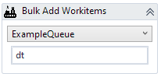  
When adding more than one Workitem it can be more efficient to create all items in one go. Bulk add, creates items based on a data table. Each row in the data table gets created as a new Workitem. To add files for each Workitem set "File Columns" to an array of the column names that will contain the fill path and filename for file(s) to attach to each Workitem. Each column in the data table will get mapped to the payload of each new Workitem

## Delete Workitem
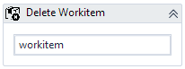  
You should never need to use this. This will delete an item from the Workitem Queue and remove any associated files from the database.

## Pop Workitem
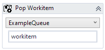  
Takes the next item, ready to be processed. Openflow will handle prioritized items, and filter out items scheduled to run in the future. Once an item has been popped it gets checked out to the current user, and set to state "Processing" and can no longer to popped. So it is important update the item to Successful or Retry once completed. The simple way to do this, is to process the Workitem in a sperate workflow and call "Invoke OpenRPA" inside a try catch activity. 

## Update Workitem
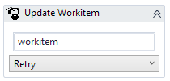  
Updates an Workitem. To the given state, and update the payload based on your changes to the payload property of the Workitem.
Generally you should never set state to failed, but set the state to "Retry" and let openflow decided what to do.
To add or update files associated with this work item set "Files" property to an array of files with the full path and filename.
If Exception is of type Business Rule Exception, the exception type will be set to "business" instead of the default "application" type.
If Exception is of type Business Rule Exception the Workitem will not be re scheduled,

## Throw Business Rule Exception
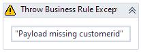  
Throw a new Exception that ends the workflow. By using this exception type we can catch the type in our "main workflow" and set exception type to business instead of the default application exception type. When ever an work item fails, we set state to "retry" and openflow will re scheduled the Work Item to try again ( until maxretries have been hit ) but we will never retry a Business Rule Exception since we already know this item will not succussed if we simply try it again.

# NodeRED nodes
## Configuration node
  
All WorkItem nodes needs a config node, defining what queue they are working with  
Right now you manually have to add the id or queue name, at some point we might add a dropdown list instead  
  

## Schedulering processing Workitems
You can setup a cron job, are scheduler to pop items, or you can add an amqp consumer, and set this consumer on an Workitem queue
This will all for a simple workflow like this, that calls a subflow for processing.  
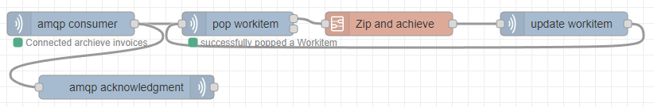
we can the distribute this workflow across multiple NodeRED for easy scaling out our workflow 

## Multiple NodeRED stages
  
Often you will split up processing into multiple steps. This way we can easily scale out certain parts, it can also make handling retries more simple and resource/time consuming having each logical step separated. We can achieve this simply by creating a Workitem Queue per step and "push" the Workitem forward after each step. Like in the picture above. We can the move the second step to a seperate NodeRED and/or create multiple NodeRED's with this workflow to scale out the Workitem handling

## Add Workitem node
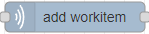  
Add a new Workitem to the selected Workitem Queue. By default msg.payload gets added as the payload to the new Workitem.  
You can supply an array for "file objects" to the files property to attach one or more files to the work item.  
Imaging you read a file on disk, or downloaded a file using the http node and have the file content buffer in msg.payload  
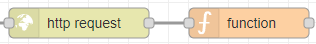  
We can add that to the workitem using  
```
msg.files = [];
msg.files.push( {
    file: msg.payload,
    filename: "kitten.jpg"
})
```  
nextrun takes a date, if this date is in the future, the workiem will not get processed until this time.  
Priority can be used to prioritize if many items are in the queue. The lower the number the more important the item is.    
msg.topic will set the name of the new Workitem  

## Add Workitems node
  
Takes an array of payloads, and creates a workitem per payload  
Allows setting a Nextrun and Priority for all items as well

## Pop Workitem node
    
Takes the next item, ready to be processed of the queue. Openflow will handle prioritized items, and filter out items scheduled to run in the future. Once an item has been popped it gets checked out to the current user, and set to state "Processing" and can no longer to popped. So it is important update the item to Successful or Retry once completed. The simple way to do this is to keep the workflow on it's own tab inside NodeRED. Then add a Catch node, set to catch errors from all nodes, and then add an update Workitem node, to set status to Retry.  
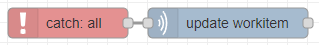  

## Update Workitem node
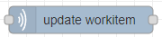  
Updates the selected Workitem, gotten using Pop Workitem.  
You can add or update files associated with the Workitem by using same syntax as with Add Workitem using an array of "file objects" set to the files property.  
If processing the item, was a success, status should by "Successful", if something went wrong, status should always be set to "Retry" then openflow will determine if, how and when to retry the Workitem based on the Workitem Queue settings.  
If retrying an item, that has already passed the Max retries on the queue, you can force the item to still be re-processed by setting Ignore max retries to true.

## Delete Workitem node
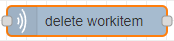  
You should never need to use this, but this node allows you to delete a payload received by the Pop Workitem node