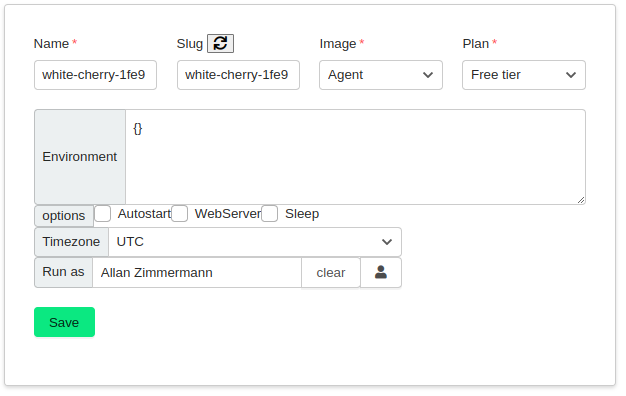

## Starting a Cloud-Hosted Agent

To launch a cloud-hosted agent:

1. In the main menu, click `Agents`.
2. Then click the `Add agent` button.

You'll encounter two main sections: agent configuration and settings.

### Agent Configuration

- **Name**: The displayed name in the agents list.
- **Slug**: A unique name for the agent, used in URLs for web interfaces or REST APIs.
- **Image**: The Docker image for the agent, containing a template for behaviors. Changing the image affects only the base image, not other settings.
- **Plan**: Defines resource allocation and runtime limits for the agent. Selection of different plans is possible based on purchased options.

### Settings

- **Environment**: Global settings for both the agent runner and all packages on the agent. This is pre-filled based on the selected image.
- **Options**: Up to three options based on permissions. Changes require restarting the agent.
  - **Autostart**: Automatically enabled for paid plans. Admins can enable this for free plans in certain scenarios.
  - **Webserver**: Indicates if the agent can host a web server, usually on port 3000.
  - **Sleep**: Overrides the image entry point for troubleshooting or manual entry point execution.
- **Timezone**: Sets the global timezone for the agent.
- **Run as**: Determines the user identity for running the agent and its packages.

Once you run the agent, OpenIAP Flow will download the Docker image and start it based on your specifications.

After 30 to 60 seconds, your agent should start. You can monitor CPU and memory usage and access console output via the `Logs` button.

## Scheduling Packages

By default, an agent listens for ad hoc job instructions. For scheduling packages, refer to the [scheduling packages](scheduling-packages) section.
