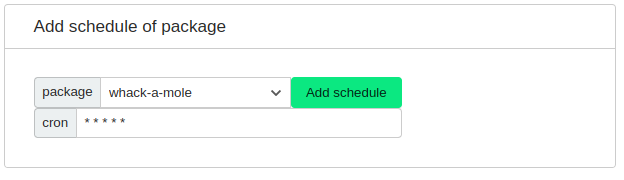
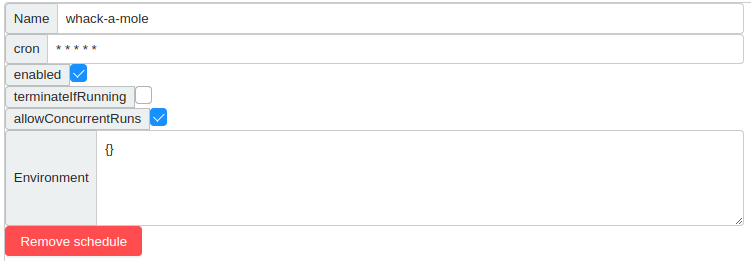

## Editing an Agent: Adding Schedules

When editing an agent in OpenCore, you'll find the "Add schedule" section at the bottom of the agent's configuration page.

### Types of Packages

There are two main types of packages you can schedule for an agent:

1. **Daemon Packages**: 
   - These packages contain code that runs continuously. 
   - Common uses include hosting a webpage or API, or consuming a message queue.
   - Daemon packages start automatically with the agent and are restarted by the agent if the process dies.

2. **Ad hoc Packages** (or non-daemon packages):
   - Function more like batch jobs, running code for a set duration before stopping.
   - Execution is complete once the process stops.
   - These packages can be scheduled to run at specific times using cron syntax.

### Scheduling Ad hoc Packages

- To schedule an ad hoc package, use cron syntax for timing.
- If you're not familiar with cron syntax, tools like [crontab guru](https://crontab.guru) can be very helpful.
- For scheduling at intervals in seconds, you can add a sixth part to the cron schedule.
- Each package has its own `Environment` section, allowing you to define variables exclusively for that package.
- Each package also has an `Enabled` checkbox. If unchecked, the agent will terminate the package if it's running and will not initiate it again.

This flexibility allows for precise control over when and how packages run on your agents, ensuring efficient and timely execution of tasks.

## Additional Settings for Ad hoc Packages

For cron-scheduled packages, there are additional options to consider:

- **terminateIfRunning**: When it's time for a scheduled package to run, this option will terminate any instances of the package that are already running.
- **allowConcurrentRuns**: If enabled, a new instance of the package will start even if another instance is already running.
- If both options are disabled, no new instances will be started if one is already running.

These settings provide additional control over the behavior of ad hoc packages, ensuring that they run according to your specific operational needs.
