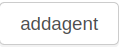
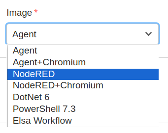
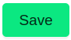
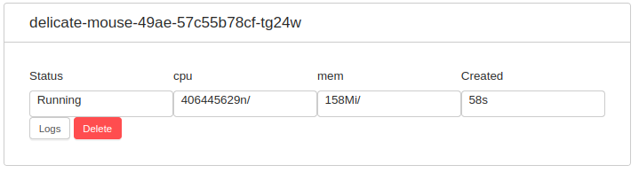
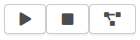
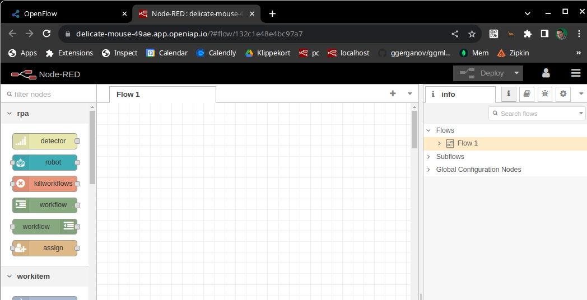
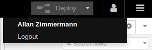

# What Is NodeRED

In OpenIAP flow you can start an agent with Node-RED preloaded with a lot of OpenIAP flow specefic nodes. Node-RED is a visual programming tool used to automate Software API's and hardware devices (IoT). Its an Open Source and much more advanced version, of closed source platforms like zapier or n8n.

It provides an in-browser editor where you can connect flows using any nodes available. Each node represents a step that when wired together forms a meaningful task. It also follows a common pattern: input, processing and output. It is important to note that Node-RED functions like a middleware to an information processing system. It simply connects the inputs to the workflows and allows them to process it. 

# Getting started

To get started, login to Openflow and then click Agents in the menu.
Then click `Add agent`

Change the name if you like, then select NodeRED in the `image` dropdown menu.

This will auto fill out the required envoriment variables for your new NodeRED instance. This is how we configure NodeRED for instance `nodered_id` tell NodeRED were to store your workflows and other information inside openflow. You can find these later in the `nodered` Collection under `Entities`

Now Click `Save` and OpenFlow will save and then start your new NodeRED instance.

If this is the first time you start a NodeRED and you are on a local installation this might take a little time, while it download the NodeRED docker image. But after a while it will say `Status` Running

> Note: you can see CPU and Memory usage here too. If you are using the cloud based version of OpenIAP Flow, and these numbers get to high, it might be time to purche a bigger instance.

Now click the last button here, to open a new tab with you NodeRED

> The first two button can be used to stop and start your NodeRED, do not worry, when ever you deploy a change in NodeRED your information is save in the database, so you can safely restart your NodeRED if needed.

# Node-RED Editor

The editor window is where all the work gets done. It contains four components: header, palette, workspace, and sidebar.

## Header

The header contains the deploy button, main menu, and, if user authentication is activated, the user menu.

### Deploy Button

The deploy button is used to deploy flows once you have finished creating or editing them. It is important to remark that you must always deploy a flow after editing it so the changes are applied.

### Main Menu

The main menu contains many actions, such as hiding components, importing or exporting flows, searching for flows, actions (like add, rename and delete) flows and subflows, manage palettes, settings, keyboard shortcuts and a link to Node-RED's webpage.

### User Menu

The user menu, if the user is authenticated, shows your username and the option to logout.

## Palette

The palette contains all of the nodes that are installed and available to use. These nodes are organized into a number of categories, which can be expanded or collapsed by clicking its header.

The entire palette can be hidden by clicking the toggle button that is shown when the mouse is over it or by pressing **Ctrl+p**.¹

¹ - [Palette](https://nodered.org/docs/user-guide/editor/palette/)

## Workspace

The main workspace is where flows are developed by dragging nodes from the palette and wiring them together.

The workspace has a row of tabs along the top; one for each flow and any subflows that have been opened. ²

### View Tools

The footer of the workspace contains buttons to zoom in and out as well as to reset the default zoom level. It also contains a toggle button for the view navigator.

To zoom in, either click the **+** button inside the view navigator or press **Ctrl+=**.

To zoom out, either click the **-** button inside the view navigator or press **Ctrl+-**.

To reset the zoom, either click the **O** button inside the view navigator or press **Ctrl+0**.

The view navigator provides a scaled down view of the entire workspace, highlighting the area currently visible. That area can be dragged around the navigator to quickly jump to other parts of the workspace. It is also useful for finding nodes that have been **lost** to the further edges of the workspace.

### Customising the view

The workspace view can be customised via the **View** tab of the User Settings dialog.

To activate the User Settings dialog, press **Ctrl+,**.

² - [Workspace](https://nodered.org/docs/user-guide/editor/workspace/)

## Sidebar

The sidebar contains panels that provide a number of useful tools within the editor.³

- **Information**
  
    View information about nodes and their help info

- **Debug**
  
    View messages passed into debug nodes

- **Configuration Nodes**
  
    Manage configuration nodes

- **Context Data**
  
    View the contents of the context variables

Some nodes contribute their own sidebar panels, such as [node-red-dashboard](https://flows.nodered.org/node/node-red-dashboard).

The panels are opened by clicking their icon in the header of the sidebar, or by selecting them in the drop-down list shown.

The sidebar can be resized by dragging its edge across the workspace.

If the edge is dragged close to the right-hand edge, the sidebar will be hidden. It can be shown again by selecting the **Show sidebar** option in the View menu, or using the **Ctrl+Space** shortcut.
