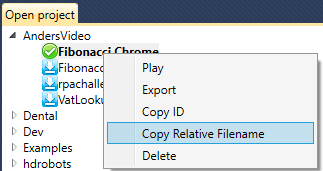
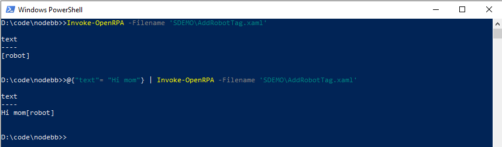

# Running Workflows from Command Line

Running OpenRPA Workflows from the command line is very easy. In this section, users will learn how to do it.
You have 2 options for invoking the robot from command line, you can use the `openrpa.exe` file directly or you can use PowerShell to get even more control over the execution

## Capturing the Workflow ID

Each Workflow in OpenRPA has a `workflow id` which is assigned upon its creation. To acquire the `workflow id` for a workflow, simply open OpenRPA, click with the right mouse button on the Workflow title and then click `Copy ID`.


Or to get the Relative filename



## Running from cmd/Commandline

You can schedule jobs from an external application, or using [Microsoft task scheduler](https://learn.microsoft.com/en-us/windows/win32/taskschd/about-the-task-scheduler) and then execute a workflow using command line parameters to the robot. 
command line
openrpa.exe accepts a number of key value pairs for running workflows from command line.
you can use - or / for defining the key, but it is optional
workflowid can either be the id for the workflow or the relative path ( project \ filename )
for instance
```sh
OpenRPA.exe /WorkflowID 5e451402478059b6448ec23f
OpenRPA.exe /workflowid project1\add_to_notepad.xaml
```
if the workflow takes arguments you can also send those from command line, for instance add_to_notepad has an "in/out" argument with the name `text`, that it adds to notepad, so you can give it the value to `text` like this

```sh
OpenRPA.exe /workflowid "dev\add_to_notepad.xaml" -text "Hi mom"
```

### Running using PowerShell
Using the PowerShell module you can also run openrpa and opencore workflow. You can pipe an object or hash table to the command to fill out workflow arguments and Invoke-OpenRPA will per default with for the workflow to complete and return an object with all out arguments. This allows for for much better control since you can now parse the result.



```powershell
Invoke-OpenRPA -Filename 'SDEMO\AddRobotTag.xaml'
# or with arguements
@{"text"= "Hi mom"} | Invoke-OpenRPA -Filename 'SDEMO\AddRobotTag.xaml'
```