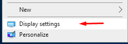
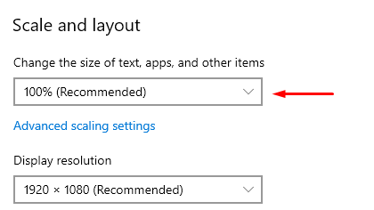

SAP recording is in beta, and only tested on version 7500.2.4.1141 of the sap client with the default theme.

Child Sessions have issues under certain types of VDI

IFrames are not supported in Internet explorer

Framesets and Iframe is not supported in xpath mode in IE

There is only limited support for Framesets and Iframe in nm (chrome/edge/Firefox) most significantly, highlighting and physical clicks are often not supported.

Virtual clicking and setting values are not working in some version of oracle JVM

Robot cannot be run from an UNC share or special One/dropbox/G-drive, all files **must** be located on the local pc.

If recording on a computer with multiple screens, try and only use the primary monitor

Recording with windows display settings where Scale and layout is not set to 100% will not work.
( you can change this back to a non 100% value after recording, if all clicks are virtual )

Disabling the embedded python and using the locally installed version will not work with anaconda python. 
A normal python install should work with version 3.5 and up to 3.7 ( needed if you want to use tkinter )