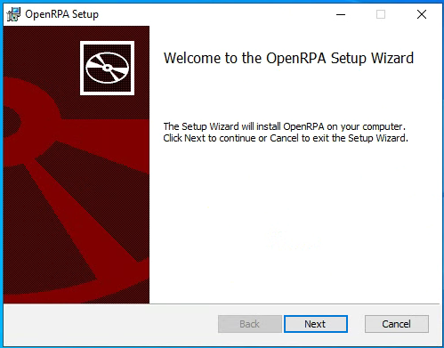
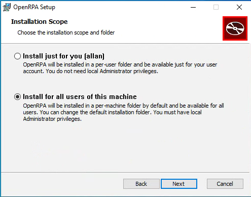
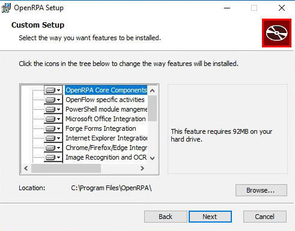
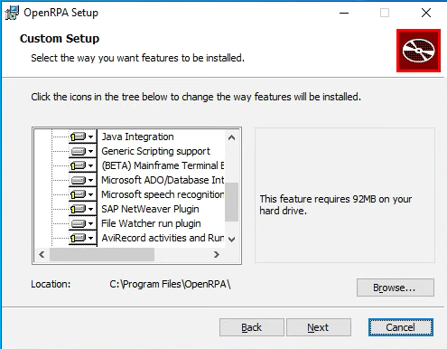
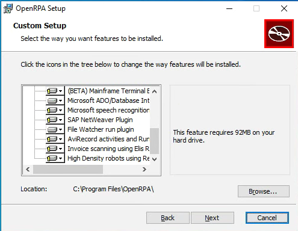

# Installing, First Run

In this section, the user is provided with a thorough explanation of how to install **OpenRPA**.

To install OpenRPA, you first need to download the installer executable provided [here](https://github.com/open-rpa/openrpa/releases/latest/download/OpenRPA.msi).
The installer is signed with an EV-certificate issues to OpenIAP ApS by DigiCert that is trusted by Microsoft.
Run the installer

Next you need to select if you want to install globally or for your own user only.

- **Install just for you**: this will install openrpa into your local user profile, this will not require administrator privileges, but in some cases it will fail to register updates to certain envoriment variables.
- **Install for all users**: This is the default and **recommended** wait to install OpenRPA. This will require administrator privileges to complete, and will install OpenRPA into Program Files.

Next you need to select if you need more than the default OpenRPA extenstions

- **OpenRPA Core**: . Is mandatory and contains OpenRPA it self.
- **Openflow Specific**: Activties for working with OpenFlow database.
- **PowerShel module**: Allow working with OpenRP and OpenFlow database from PowerShell
- **Microsoft Office**: This will be hidden if installer did not detect a supported version of Microsoft Office (2010+). Add ability to record, and activities to work with Microsoft Office directly.
- **Forge Forms**: Add activities for doing user interaction using forms from inside OpenRPA workflows.
- **Internet Explrer**: Add ability to record, and activities for working with Internet Explorer.
- **Chrome/Firefox/Edge**: Add ability to record, and activities for working with browser supporting Native Messaging using the [OpenRPA chrome extention](https://chrome.google.com/webstore/detail/openrpa/hpnihnhlcnfejboocnckgchjdofeaphe).
- **Image Recogition and OCR**: Add ability to record, and activities for working with automation using Image Recogition.
- **Java Integration**: Add ability to record, and activities for working with automation using [Java Bridge](https://www.oracle.com/java/technologies/javase/javase-tech-access-bridge.html).
- **Generic Scripting Support**: Add activities for writing and executing code written for VB/C#/Python/PowerShell and AutoHotKey. 
- **Mainframe Terminal**: Add ability to record, and activities for working with mainframes (vt 5250/3270).
- **Microsoft ADO**: Add activities for working with any MSJET/MSADO supported data, also soetimes called ODBC. For instance Excel/Access/Microsoft SQL Server/Oracle databases/MySql/PostgreSQL 
- **Microsoft Speech**: Add activities for working with any microsoft Speech API. Allows the robot to react to voice command and to read out text to the user (Text 2 Speech)
- **SAP NetWeaver**: Add ability to record, and activities for working with SAP using [SAP GUI scripting](https://help.sap.com/docs/sap_gui_for_windows/b47d018c3b9b45e897faf66a6c0885a8/babdf65f4d0a4bd8b40f5ff132cb12fa.html).
- **File Watcher**: Add the file watcher derector. This allows the Robot to wait on Windows File System Notofication on specific folder/files.
- **AviRecorder**: Add abilities to OpenRPA for doing automatic screen redordings, and adds activities for working manually with screen recordings.
- **Invoice scanning with Rosum**: Add abilities to OpenRPA for doing integrating with rosum ai for invoice processing.
- **High Density Robots**: Add tools and extensions to OpenRPA that allows installing a Windows Server on the machine to login in one or more RDP session on the local machine and keep OpenRPA running inside those. This requires OpenRPA to be installed for all users, it requires OpenRPA is talking to OpenFlow.

After completion, you can find OpenRPA in the start menu.

