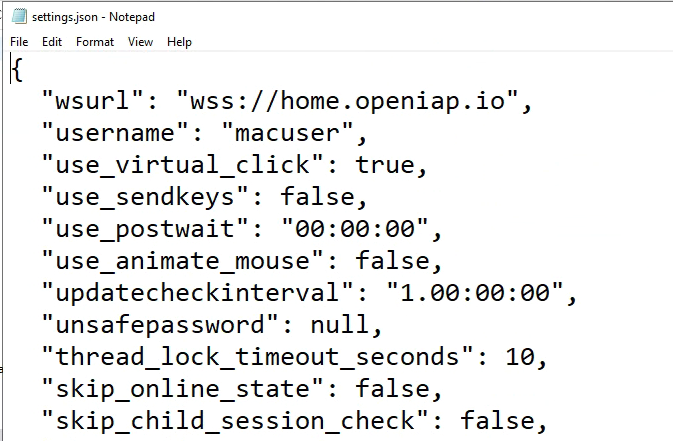
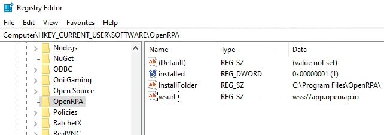
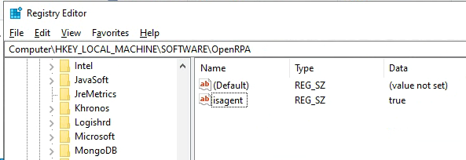

# Configuring OpenRPA

**OpenRPA** settings are saved locally in a file named `settings.json` and it is located in user's `Documents\OpenRPA` folder (or full path `C:\Users\{YOUR_USER}\Documents\OpenRPA`). This file contains all configuration parameters for **OpenRPA**, including some which are not accessible through the GUI.

`settings.json` will contain all "bases" settings, used by OpenRPA and a collection of all settings for each extension installed in OpenRPA, for this reason, the file will contain a different amount of valyes depending on what extensions have been installed. 

If you are in a coreprate envoriment using [roaming profiles](https://learn.microsoft.com/en-us/windows-server/storage/folder-redirection/deploy-roaming-user-profiles) and/or [folder redirection](https://www.cs.washington.edu/lab/windows/profiles) it's recommend that you move the OpenRPA folder and settings.json file into the user's AppData folder, and remove the corrosponding folder in the Documents folder.

When you start **OpenRPA** it will load `layout.config`. This will store the user's layout preferences (panel sizes, order, location etc). This file is updated when you exit OpenRPA. To reset all UI elements to the defaults, simple cose OpenRPA and delete this file.

Unless you are running [in offile mode](Offline) OpenRPA will Create/Open a .db file stores in the users OpenRPA folder. The name of the file will match the domain name of the OpenFlow it's connected to. This way, OpenRPA does not hve to redownload all data, when ever you are switching between different OpenFlow installations.
If somethings goes wrong, you can always close OpenRPA and delete this file, then OpenRPA will re-create it and download all workflows it has access to next time you start it.
> important note: do NOT delete this file, if you are in offline mode. This is where all data is stored. Often make backup's of this file, if you are in Offline mode. For users connection to OpenFlow, version control and backups are handling using OpenFlow.

Editing either file (`settings.json` / `layout.config`) while **OpenRPA** is running will have no effect and, when the application is closed, any value changed will be lost/overwritten. Hence, if you desire to edit any setting, always make sure that **OpenRPA** is not running.

Every setting found in the settings.json file can be overriden using registry keys.
To override for a given user, set the values in 
Computer\HKEY_CURRENT_USER\SOFTWARE\OpenRPA

Similar, you can override the value for all users by setting 
Computer\HKEY_LOCAL_MACHINE\SOFTWARE\OpenRPA

## Common settings
Below is some of the common settings explained

- **wsurl:** Url of the Openflow you want to connect OpenRPA to. use wss:// if your openflow is using ssl  certificate, use ws:// if it does not.
- **notify_on_workflow_end:** Show a Windows notification when a workflow has ended.
- **notify_on_workflow_remote_start:** Show a Windows notification if OpenFlow has requested a workflow to be run.
- **notify_on_workflow_remote_end:** Show a Windows notification when a workflow triggered remotly has completed.
- **isagent:** If set to true, OpenRPA will start with UI in a compact mode, with out access to the Workflow Designer. This mode is meant for Assisted Robotics, were you want a "slim" UI for the end users.
- **updatecheckinterval:** By default OpenRPA will register a watch in OpenFlow to detect changes in the database, but if you are connected to an older OpenFlow that does not support this, OpenRPA will pull for updates with this interval
- **thread_lock_timeout_seconds:** If 2 threads try to work with the UI, each thread will wait this long to get excluise access, and if not, it will throw an exception in the log windows and continue.
- **skip_online_state:** By default OpenRPA will save state for running workflow, this means if you close OpenRPA or the machine restarts, when OpenRPA starts again, it will continue the workflow from last persist. This information is also save inside OpenFlow. To save bandwith or DB space you can disable saving the state online here.
- **disable_instance_store:** To completly disable saving state, set this to false. 
- **skip_child_session_check:** Doing startup OpenRPA will try and detect if it is running inside a Child Session ( sometimes also called Picture in Picture ). If OpenRPA detect it is running inside a child session it will not update the config file and it will not register watches and queues. This will also disable remote running except using the special PowerShell commands. It's the "hosts" responsibility to handle these things. Sometimes on VDI installations OpenRPA will detect all OpenRPA instances as running in a child session, if this happens to you, set this value to "true"
- **showloadingscreen:** if "isagent" is set to false, you can disable the OpenRPA loading screen here. In verson 1.4.55 the loading screen has been removed, but the setting has been kept for backward compatibility.
- **username:** This field will get updated when ever you signin.
- **entropy:** key needed to decrypt jwt or password, only windows user that created this can decrypt it, so copying this config fole to a different user will not work, and will make OpenRPA prompt the user to login again.
- **jwt:** Encrypted JWT token issued by OpenFlow to the user.
- **password:** encrypted Password, to set this, use **unsafepassword** and doing next start of OpenRPA the password till be encrypted and unsafepassword reset.
- **remote_allowed:** Disable to never allow OpenFlow to remotely run workflows on this robot.
- **remote_allow_multiple_running:** If allowed, do we allow running more than one workflow at the time ? Since RPA is about automating the UI we cannot allow multiple workfows to try and control the desktop. It is highly recommend to keep this set to false. You can still allow more than workflow to run by marking certain workflows as "background" workflows, do this for workfows that will never interact with the UI. This way, those workflows will not "count" as running,
- **remote_allow_multiple_running:** If multiple allowed, how many ?
- **remote_allowed_killing_self** Do we allow OpenFlow to tell the robot to kill any running instances of the workflow it's trying to run (kill if running)
- **remote_allowed_killing_any** Do we allow OpenFlow to tell the robot to kill **any** workflow running or just the same workflow as it's requesting us to run.
- **recording_add_to_designer:** By default, when you are recording, OpenRPA will add every single activity to the workflow right away. On low end hardware this can have a big performance inpact, there for you can allow OpenRPA to collect each action and first add them to the workflow at the end. When using this be very carefull to not work to fast, or OpenRPA cannot keep up and will "miss" certain actions.
- **querypagesize** When OpenRPA is requestiong data from OpenFlow how many items does it get at a time ? 
- **ocrlanguage** If image recognition extension has been installed, what are the langauge we want to use for doing OCR on he screen.
- **noweblogin** Disable requesting user to login using browser. This forces login to only work using `username` and `unsafepassword`
- **max_workflows** limit the robot to only download this amount of workflow. ( to avoid crashing when signed in as an admin with access to everything )
- **max_projects** limit the robot to only download this amount of projects. ( to avoid sluggish UI when signed in as an admin with access to everything )
- **max_trace_lines** Limit the amount of lines in the loggin window. The more lines that is allowed the bigger the performance impact on OpenRPA. Keep this as low as possible
- **max_output_lines** Limit the amount of lines in the output window. The more lines that is allowed the bigger the performance impact on OpenRPA. Keep this as low as possible
- **enable_analytics** Allow OpenIAP to collect anonymous usage data.
- **log_to_file** If set to true, will log all tracing information to a file. This will add **alot** of overhead to OpenRPA, only use for troubleshooting.
- **properties** This object will contain all extension settings

