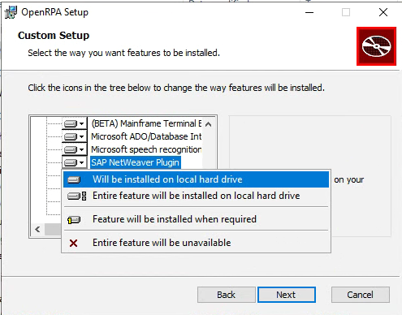

# Enable OpenRPA for SAP
OpenRPA uses SAP GUI Scripting to record and do actions inside SAP.

Sap is not installed by default, you need to specefy this, when running OpenRPA.msi. If you did not install it, you can somply run OpenRPA.msi again to modify your installation.

# Enable SAP Sserver for Scripting

You can enable scripting by setting the profile parameter sapgui/user_scripting to TRUE. The value set using this procedure will be lost when the system is restarted.
Contact your administrator to make this setting enabled permenantly.
( See [screenshots here](https://winshuttle-help.s3.amazonaws.com/step-by-step/en/transaction/enable-gui-scripting.htm) )

1. Call transaction RZ11.

2. On the Maintain Profile Parameters screen, enter sapgui/user_scripting.

3. Choose Display.

4. In the Display Profile Parameter Attributes screen, choose Change value.

5. Enter TRUE in the New value field.

6. Choose Save.

On some systems this will not work when `sapgui/user_scripting_per_user` has been set to `TRUE`. In that case you need to enbale scripting on the users profile.

1. Access User Profile:
   - Execute transaction: SU01
   - Enter username to modify.

2. Edit User Profile:
   - Click on the "Edit" button.

3. Navigate to Parameters Tab:
   - Go to the "Parameters" tab.

4. Add SAP GUI Scripting Parameter:
   - Add a new row in the parameters.
   - Parameter ID: sapgui/user_scripting
   - Parameter Value: TRUE

5. Save Changes:
   - Save the modifications to the user profile.

6. Log Off and Log On:
   - The user needs to log off and then log back in for the changes to take effect.

# Enable SAP Client for Scripting

Next we need to enable scripting in SAP GUI Client.

1. Click Customize Local Layout, and then click Options
2. Click Accessibility & Scripting, and then click Scripting
3. Check the Enable scripting box
4. Click OK

# Working for SAP from OpenRPA videos

These below videos will also explain some things about SAP and OpenRPA

Get a good start with SAP in OpenRPA

  

Running OpenFlow offline and some MQTT stuff

  

