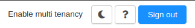
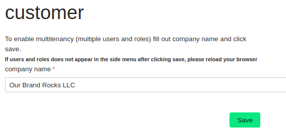

## Enable Multi-Tenancy

To create users and roles, and to allow the purchase of extra services, you will need to **Enable multi-tenancy**. Simply click the [Enable multi tenancy](https://app.openiap.io/#/Customer) link located in the top right corner of the page.

This action creates a customer object, which is used to isolate all data for those users and services within a single tenant. You will then be prompted to confirm the company name.

> **Note:** 
> If the page doesn't refresh automatically after a few seconds, you can manually reload it by pressing F5.

After refreshing, you will see a page where you can purchase additional services.

With multi-tenancy enabled, the main menu will now offer more options. For example, you can add more users by clicking on [Users](https://app.openiap.io/#/Users).
