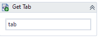


# Get tab

Using Result property will return the current tab open  
Using Results property will return an array with all open tabs  
By default uses chrome for Result, and all browser for "Results"  
To filer or set browser type, set "Browser" property to "chrome", "ff" or "edge"  